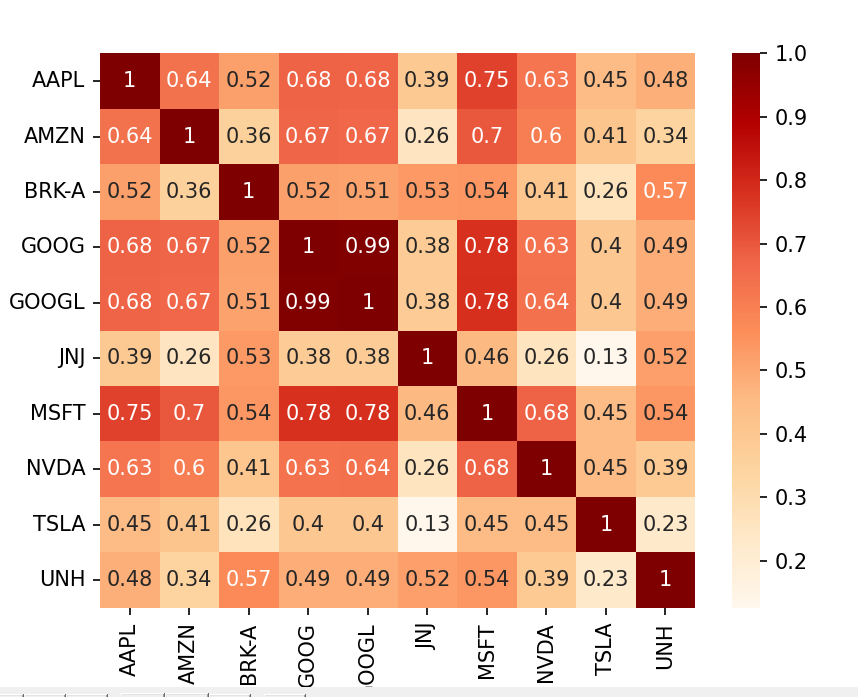
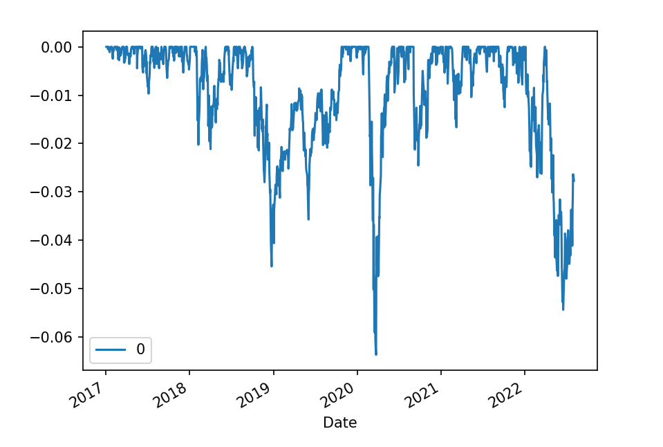

# Portfolio Weighting and Optimization


## Introduction

I first construct an equally weighted portfolio with the 10 highest market cap S&P500 companies in 2022. Next, I calculate its performance, risk, and correlation on a heat map. I finally made an optimization to reduce its volatility using CAPM

## Required libraries

```` markdown
import pandas as pd
import time
import yfinance as yf
import matplotlib.pyplot as plt #for graphs
import numpy as np #for math operations
import seaborn as sns #for visualisation
import pandas_datareader.data as web #for reading financial data
import matplotlib.ticker as ticker #to change graph axes
from datetime import datetime #date manipulation
import pypfopt as pypfopt
from pandas_datareader import data
````

## Topics discused


## Heatmap correlation of returns

## Portfolio Standard Deviation and Covariance Matrix
## Risk Trade Off

#CAGR & Drawdown of portfolio


## Minimum Variance Optimization

 1.EV
 
 2.Efficient frontier
 
 3.Performance with optimal weightings:
 
 


